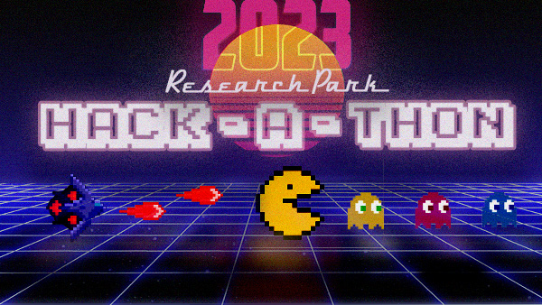

[submission_link]: https://www.google.com
[uirp_event_link]: https://researchpark.illinois.edu/all-events/2023-research-park-hackathon/
[uirphack_link]: https://github.com/uirphack
[illini_snake_link]: https://github.com/uirphack/illini_snake
[request_access_link]: https://www.google.com

# 2023 Research Park Hackathon

Welcome to the 2023 Research Park Hackathon! Here are some helpful links:
* [Project Submission][submission_link]
* [Request Access to GitHub Organization][request_access_link]
* [UIRP Event Info Page][uirp_event_link]
* [uirphack - GitHub][uirphack_link]

# Hackathon Prompt
* Create a functioning video game
    * Games can be created in any programming language / framework
* Incorporate your company's branding and/or industry into your game design
* Video games are to be created with the theme "Retro Video Games"
    * Think 2-Dimensional

# Submission 
**To submit your Hackathon Project, click [here][submission_link].**

## Requirements
Follow along for submission requirements for your code, video, and presentation (finalists only).
* Code (GitHub)
    * All code used in your project is contained on your repo's main branch
    * A **README.md** file containing *at least* the following
        * The names and companies of your hackathon group
        * Link to your [YouTube Video](https://www.youtube.com/watch?v=dQw4w9WgXcQ)
        * "How-to-Play" section for your video game
        * Image or GIF representing your video game
    * Repositories with commits after the submission deadline will be disqualified
* Video (YouTube)
    * A video between 60-120 seconds in length
    * The video must contain at least 60 seconds of gameplay footage
    * Video published to YouTube (either public or unlisted)
* Presentation / Game Demo (Live) - *Finalists Only*
    * Presentation to Judge Panel can last **no longer than 5 minutes**
    * At least two minutes of the presentation must be reserved for **live gameplay** from a representative of the judges panel
        * Hackathon team is required to provide a machine on which the judges can play the video game

## Instructions
Follow along for instructions on how to submit your project.

### Code
* Create a **private** repository within the GitHub organization [uirphack][uirphack_link]
    * Feel free to use the [illini-snake][illini_snake_link] repository as a template
* Commit all code and satisfy all requirements listed above
* Repositories will automatically be made public after the submission deadline

### Video
* YouTube videos must be posted as public or unlisted

### Presentation / Game Demo
* Teams are able to present their project in whatever manner they choose, so long as the requirements are met

## Integrity
TBD

# Schedule 

## Wednesday, July 19th 2023
* **8:30 AM**: Hackathon Prompt Instructions @ EnterpriseWorks Atrium
* **9:00 AM**: Open Hacking Begins @ various Research Park locations
* **12:00 PM - 1:00 PM**: Lunch provided for all participants @ EnterpriseWorks Atrium
* **11:59 PM**: **Submission Deadline**

## Thursday, July 20th 2023
* **10:00 AM**: Finalists announced via email
* **12:00 PM - 12:45 PM**: Finalist presentations @ EnterpriseWorks Atrium; open to all
* **5:00 PM**: Winners announced at Fire @ Five

# Evaluation Criteria
* Theme Accuracy
* Company / Industry Incorporation
* Overall Creativity 
* Game Functionality and Design
* Video
* *Live Presentation (Finalists Only)*
* *Live Gameplay (Finalists Only)*

# Awards
TBD
* 1st Place
* 2nd Place
* 3rd Place

# Judges Panel
* **Matt Ahrens**: *Data Science* - NVIDIA
* **Anna Chi**: *UX Designer* - Brunswick
* **Ben Kimmel**: *Manager, Software Engineering* - Cargill
* **Jarai Carter, PhD**: *Manager, Data Science* - John Deere
